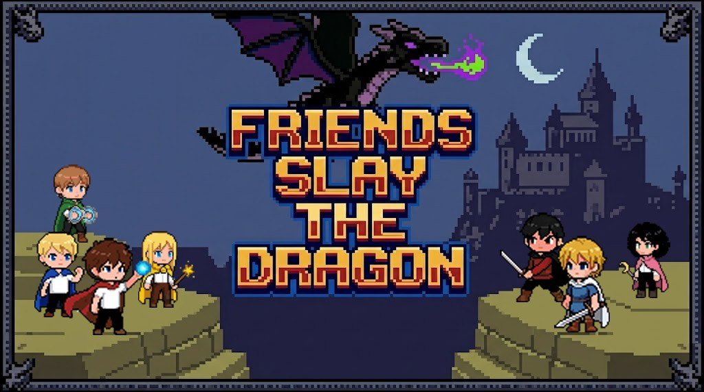

# Friends Slay the Dragon

A chaotic, couch-ready castle brawler where you and your friends charge through gothic halls, inhale terrifying monsters, and steal their powers to take down a dragon that absolutely has it coming.

---

## What even is this?

You're a little bored. The castle is enormous and full of zombies, skeletons, flying ducks, and a very dramatic boss dragon. You run. You jump. You **inhale enemies whole** and absorb their elemental powers — fire, lightning, ice — then unleash them on everything else in the room. Break every piece of furniture you see.

Somewhere deep in the castle, past a gothic double-door with iron knockers and a foreboding glow, the dragon waits. He breathes fire. He shoots lightning bolts. He rains icicles. He is not having a good day, and neither will you — until you're not.

## Play with friends

Play locally by yourself. Or create a room on the server for up to 4 players. Use a keyboard or connect controllers. The chaos scales perfectly.

## Go play

**[friendsslaythedragon.up.railway.app](https://friendsslaythedragon.up.railway.app)**

No download. No install. Just vibes and dragon-slaying.

---

*Built with [Phaser 3](https://phaser.io/) · Multiplayer powered by WebSockets · Server deployed on [Railway](https://railway.app/)*
